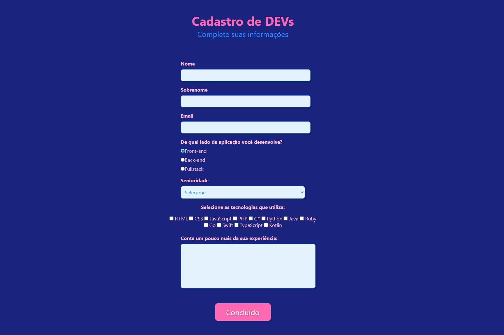

   <h1> Formulário Moderno e Responsivo </h1> 

Este projeto é uma refatoração de um formulário com HTML e CSS, inspirado no tutorial da Rafaella Ballerini, com o objetivo de criar um design mais moderno e responsivo, utilizando uma paleta de cores em azul royal e rosa.

### Linguagens e Tecnologias Utilizadas

Este formulário foi construído utilizando as seguintes linguagens de programação, cada uma com sua função específica:

  * **HTML (HyperText Markup Language)**
    O HTML é a linguagem de marcação mais básica da web, utilizada para definir a estrutura e o conteúdo de uma página. É o esqueleto de qualquer site.
  * **CSS (Cascading Style Sheets)**
    O CSS é o código usado para estilizar a página web. Ele define a aparência e a apresentação do conteúdo, como cores, fontes, layouts e espaçamento.

### Links Úteis

  * **Git da Rafaella Ballerini:** [https://github.com/rafaballerini](https://github.com/rafaballerini)
  * **Link para o Vídeo do Tutorial:** [https://www.youtube.com/watch?v=wwqOJ2o84S4](https://www.youtube.com/watch?v=wwqOJ2o84S4)

### Imagem do Formulário

